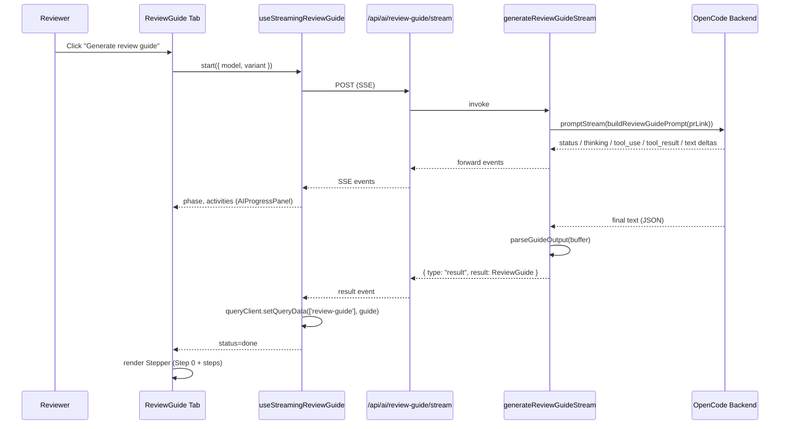

# feat: AI PR Review Stepper Guide

## Summary

Add a third **Review Guide** tab to the side panel that, on manual trigger, calls a new SSE-streaming endpoint to produce a synthesized PR overview, an ordered list of file-group steps with per-step "what to look at" notes, and "needs your judgment" comment threads. The implementation reuses CLM's existing CTA + model-picker primitives and the `useStreamingReview` SSE pattern; judgment threads are persisted as a new client-side resource separate from GitHub draft review comments and rendered with the existing `CommentThread.Inline` UI plus an AI-source badge.

---

## Problem Frame

A reviewer opening a cold PR in CLM today has intelligent grouping (per-group summaries, no overall PR narrative, no recommended reading order) and an AI review summary (issues from the AI's perspective, not a handoff list of decisions the AI cannot make). Neither closes the first-open orientation gap, and neither captures the cases that matter most for human review — places where the AI lacks team or product context. See origin: `docs/brainstorms/2026-05-09-ai-pr-review-stepper-guide.md` for the full pain framing, actors, flows, and acceptance examples.

---

## Requirements

Carried verbatim from origin where they constrain the plan; cite origin R-IDs.

- R1. Guide generation is manually triggered (no auto-generate on PR load). *(origin R1)*
- R2. Trigger surface mounts the existing model-selection primitive (`ActionSettingsPopover`); no new model-management UI. *(origin R2)*
- R3. Pre-generation CTA state replaces the stepper. *(origin R3)*
- R4. During-generation progress state and failure-revert-with-retry; partial output discarded. *(origin R4)*
- R5. Step 0 is a synthesized PR Overview ("what this PR is and why"); the overview must add cross-file dependencies, change-shape inference, or "spine" of the change beyond the PR description (resolves origin P2). *(origin R5)*
- R6. Subsequent steps map to groups of related files. *(origin R6)*
- R7. Each step has a one-line rationale for its position in the route plus per-step "what to look at" notes that reference specific symbols, line ranges, or named decisions (resolves origin P2 quality constraint). *(origin R7)*
- R8. Each step has a "reviewed" check; cumulative progress visible at all times via per-step checkmarks plus a fraction counter in the stepper header. *(origin R8)*
- R9. Advancing through steps drives the diff viewer to focus the current step's file group. *(origin R9)*
- R10. Off-route navigation is non-blocking; muted "off-route" indicator on the current step card with a "Return to recommended step" affordance. *(origin R10)*
- R11. Coexistence with existing intelligent grouping in v1 — the Grouping tab and AI Review tab remain unchanged; the Review Guide is a new tab. *(origin R11)*
- R12. AI emits "needs your judgment" items anchored to specific lines, only for cases requiring concrete human/team/product context (precision floor). *(origin R12, R17)*
- R13. Judgment threads persist as comment threads (resolvable, repliable, included in the submitted review) and carry a persistent "AI · needs your judgment" badge. *(origin R13)*
- R14. Re-generation is supported via a modal showing the count of unresolved AI-created threads to be discarded plus the list of pinned threads preserved; explicit confirmation required. *(origin R14)*
- R15. On regeneration: unresolved AI-created threads are discarded except pinned ones; resolved, pinned, and reviewer-authored threads are preserved. *(origin R15)*
- R16. Trivial PRs (≤1 substantive step beyond Step 0) render Step 0 plus the single step inline without step-progression UI plus a one-line "trivial change" note. *(origin R16)*
- R17. Judgment-thread emission obeys an upper-bound density heuristic per K lines changed, encoded in the prompt. *(origin R17)*
- R18. Reviewers can pin individual judgment threads (resolved or unresolved) to preserve them across regeneration. *(origin R18)*
- R19. Model picker selection is sticky across PRs as a per-action user preference (action key `review-guide`); per-generation override becomes the new default. *(origin R19)*

**Origin actors:** A1 (Cold reviewer), A2 (Guide-generation AI).
**Origin flows:** F1 (First-time guide generation), F2 (Stepping through), F3 (Off-route navigation), F4 (Re-generating).
**Origin acceptance examples:** AE1 (R1, R3), AE2 (R10), AE3 (R12, R13, R17), AE4 (R14, R15, R18), AE5 (R4 / F1 failure), AE6 (R16).

---

## Scope Boundaries

- PR-author self-review flow.
- Mid-review stuck-reviewer rescue.
- Static briefing card (Approach A) and inline-annotation (Approach C) variants.
- Replacing or restructuring the existing AI review summary.
- Cross-PR memory.
- User settings for customizing the AI's reading-order heuristic.
- Adding model providers or model-management UI beyond what CLM exposes.
- Changing CLM's AI backend wiring (OpenCode integration) beyond invoking it for a new prompt.
- Full absorption of intelligent grouping into the stepper (origin R11 explicitly defers).
- Server-side or filesystem persistence of guides — guide state is transient client cache, matching how AI review items behave today.
- Comment-system schema changes — judgment threads stay client-local until review submission.
- AI cost / token-usage telemetry.

### Deferred to Follow-Up Work

- **Keyboard navigation, focus management, and screen-reader live-region announcements for the stepper** — flagged P2 in origin review; not blocking v1 but should follow shortly. Separate PR.
- **Density rubric prompt-tuning** for judgment-thread emission (origin Outstanding Q on R17) — needs prompt-design experimentation against real PRs; separate research effort feeding back into the prompt builder.
- **Refactor `IntelligentGrouping` to share group-rendering UI with the stepper** — defer until stepper grouping output is validated.
- **Submit-time integration of judgment threads into the GitHub review payload** — surfaced as a follow-up because it touches the review-submission path; v1 keeps threads visible in the CLM UI and emits them as part of the review body when submission is wired.

---

## Context & Research

### Relevant Code and Patterns

- `packages/client/src/components/side-panel/index.tsx` — `Tabs` structure to extend with a third tab; current tabs are `grouping` and `ai-review`.
- `packages/client/src/components/side-panel/side-panel-container.tsx` — owns AI action hooks, mounts `ActionTriggerWithContext`, `ActionSettingsPopover`, and `AIProgressPanel`. The new tab follows the same composition.
- `packages/client/src/components/side-panel/action-trigger-with-context.tsx` — CTA + additional-context surface to reuse.
- `packages/client/src/components/side-panel/action-settings-popover.tsx` — model picker (R2 mount target).
- `packages/client/src/components/side-panel/ai-progress-panel/index.tsx` — during-generation progress UI to reuse for R4.
- `packages/client/src/hooks/use-ai-review.ts` — `useStreamingReview` / `useStreamingGrouping` reducer pattern; the new `useStreamingReviewGuide` hook mirrors this shape verbatim including TanStack Query cache write on `result`.
- `packages/client/src/components/comment-thread/inline-comment-thread.tsx` — already branches on `comment.author.type === 'ai'`; the AI-source badge slots into this branch.
- `packages/client/src/components/diff-panel/diff-panel-context.ts` — context to extend with `focusFileGroup(filePaths)` and an `offRouteFilePath` selector.
- `packages/client/src/types/review.ts` — `ReviewComment.author.type` already supports `'ai'`; judgment threads do not require a type-system extension.
- `packages/client/src/lib/storage.ts` — `StorageKeys` enum to extend for the side-panel-tab persistence (existing key already covers tab state).
- `packages/server/src/routes/grouping.ts` — sibling SSE route to mirror (`/api/ai/grouping/stream`).
- `packages/server/src/services/grouping.ts` — sibling streaming service to mirror; uses `streamAiResponse`, `extractJsonBlock`, `parseJsonSafe`, `getAiBackend`, `getModelForAction('grouping')`, `getVariantForAction('grouping')`.
- `packages/server/src/services/ai-review-prompt.ts` and `ai-review-prompt.test.ts` — prompt builder + unit-test pattern to mirror.
- `packages/server/src/services/settings.ts` — `getModelForAction` / `getVariantForAction` to extend with the new `review-guide` action key.
- `packages/server/src/utils/json-extract.ts` — `extractJsonBlock` and `parseJsonSafe` for parsing the guide's single-line JSON output.
- `packages/server/src/utils/sse.ts` — `streamAiResponse` reuses unchanged.

### Institutional Learnings

- `docs/plans/2026-05-08-001-feat-streaming-ai-review-plan.md` established the SSE event taxonomy (`status`, `thinking`, `tool_use`, `tool_result`, `text`, `result`, `done`, `error`) and the cancellation pattern; the guide stream piggybacks on this without inventing new event types.
- `docs/2026-02-07-global-settings-model-selection-design.md` and `docs/2026-02-07-global-settings-model-selection-plan.md` — establishes the per-action model selection model and TOML persistence approach this plan reuses.

### External References

- None used. Local patterns are sufficient (existing streaming pipeline, existing comment-thread primitives, existing model-selection persistence).

---

## Key Technical Decisions

- **Single AI call producing the entire guide** (overview + ordered steps + judgment threads), not three separate calls. Rationale: minimizes round-trip latency, lets the model maintain coherence between overview / step rationales / judgment items, and matches the existing AI-review and grouping single-call shape. The structured JSON schema (see Implementation Unit U2) is the contract.
- **Guide-generation runs its own AI pass with its own grouping**, distinct from the existing `generateGroupingStream`. Rationale: addresses origin's deferred Q on R6/R11 — coexistence in v1 explicitly avoids absorbing intelligent grouping; the guide's grouping is optimized for "reading route" not "review-by-risk." Sharing implementation would prematurely couple the two.
- **Judgment threads are a new client-side resource** (`JudgmentThread`) distinct from GitHub draft review comments. Rationale: judgment threads need fields GitHub drafts don't have (`source: 'ai-judgment'`, `pinned`, AI-anchored `anchorReason`) and lifecycle that doesn't map to draft-review semantics (regeneration discard, pin-to-preserve). Folding them into draft comments would bleed AI-specific lifecycle into the comment-system core. Submission-time flattening into the GitHub review body is deferred to follow-up work.
- **Judgment-thread persistence is client-side only in v1** (TanStack Query cache, key `['review-guide']`). Rationale: matches AI review items' transience; keeps server stateless; avoids the schema-change blast radius of a server-side judgment-thread store. Survives in-app navigation but not page refresh, consistent with existing AI surfaces.
- **Off-route detection is derived state, not a stored mode.** Compare `selectedFilePath` against the current step's `fileGroup`; emit a small UI affordance when divergent. Rationale: avoids a new selection mode in `DiffPanelContext`; the only context change is one new method (`focusFileGroup`).
- **AI-source badge is a new shared component (`AiSourceBadge`)** rather than reusing the existing AI severity styling on `AIReviewSummary`. Rationale: the existing AI styling expresses severity ("critical/warning/info"); the badge expresses provenance + handoff intent ("AI · needs your judgment") and must persist after thread resolution. Different semantics warrant a different component.
- **Trivial-PR rendering (R16) is a client-side detection** (`steps.length <= 1`), not a server-side schema branch. Rationale: simpler contract — the AI always returns the full schema; the client decides layout. Keeps the prompt simple and the parser deterministic.
- **Step 0 is a permanent first entry that can be marked "reviewed" like any other step.** Rationale: resolves origin P2 ambiguity; treating it identically to other steps keeps the progress model uniform (fraction counter `n/total` includes Step 0).
- **Re-generation modal renders inside the side panel surface using the existing shadcn/ui `Dialog` primitive.** Rationale: there is no established CLM destructive-action confirmation pattern (origin deferred Q); the shadcn `Dialog` + count-disclosure copy is the right baseline and can be extracted to a shared confirmation primitive when a second use site appears.

---

## Open Questions

### Resolved During Planning

- **Does CLM's comment-system support programmatic AI-source thread creation, persistent visual markers, and inclusion in submitted reviews?** (origin Resolve-Before-Planning question)
  Resolution: `ReviewComment.author.type === 'ai'` already exists in `packages/client/src/types/review.ts` and `inline-comment-thread.tsx` already branches on it for visual treatment. v1 ships judgment threads as a new client-side resource (`JudgmentThread`) reusing the comment-thread UI and the AI author type; submission-time flattening into the GitHub review payload is explicitly deferred (see Scope Boundaries → Deferred). The R13 "included in the final review submission" requirement is therefore staged: in v1 threads exist as durable session-local items addressable by the reviewer; the submission integration is a separate PR. *Stage this caveat with the user at v1 review time — the brainstorm authored R13 expecting in-band submission; planning has narrowed v1 to the in-CLM lifecycle and deferred submission.*
- **How does guide-generation produce groupings — call existing logic, replace, or own pass?** (origin Deferred-to-Planning question on R6, R11)
  Resolution: own pass. See Key Technical Decisions.
- **Wire format for judgment threads — reuse existing comment-thread schema or add `source: ai-guide` marker?** (origin Deferred-to-Planning question on R12, R13)
  Resolution: new `JudgmentThread` resource, distinct shape with `source: 'ai-judgment'`, `pinned`, `anchorReason`. See Key Technical Decisions.
- **How is generation progress streamed?** (origin Deferred-to-Planning question on R4)
  Resolution: reuse the SSE pattern from `useStreamingReview` / `streamAiResponse` exactly. New `useStreamingReviewGuide` hook + new `/api/ai/review-guide/stream` route mirror the existing pair.
- **Diff-panel primitive for "focus this file group" and "mark off-route".** (origin Deferred-to-Planning question on R9, R10)
  Resolution: extend `DiffPanelContext` with `focusFileGroup(filePaths)`; off-route is derived from `selectedFilePath` vs the current step's group, no new selection mode.
- **Established AI-source visual treatment in CLM?** (origin Deferred-to-Planning question on R13)
  Resolution: none for the "needs your judgment" semantic. New `AiSourceBadge` component.
- **Established destructive-action confirmation pattern?** (origin Deferred-to-Planning question on R14)
  Resolution: none yet. Use shadcn/ui `Dialog` with count-disclosure copy; extract when reused.

### Deferred to Implementation

- Exact prompt wording, K-lines-per-judgment-thread upper bound (R17), and the discrimination rubric phrasing — needs to be tuned against real PRs (separate prompt-tuning effort, see Deferred to Follow-Up Work).
- Exact copy for the regeneration confirmation modal, the off-route affordance, and the trivial-PR note — small UX writes that should match CLM's existing voice; resolved during implementation review.
- Decide whether the "reviewed" state survives regeneration for steps whose file groups are identical across runs. Likely yes, but depends on a stable group-identity heuristic that is easier to evaluate against real generated guides than to design upfront.
- Precise progress-counter copy and placement (e.g., "2 / 5 reviewed" vs "Step 2 of 5") — settled at component-build time.

---

## High-Level Technical Design

> *This illustrates the intended approach and is directional guidance for review, not implementation specification. The implementing agent should treat it as context, not code to reproduce.*



**Guide JSON schema (directional — not a wire-format spec):**

```text
{
  overview: string,                           // PR Overview narrative for Step 0
  steps: [
    {
      id: string,
      title: string,                          // group title
      fileGroup: string[],                    // repo-relative paths
      rationale: string,                      // one-line "why this position"
      lookFor: string                         // per-step "what to look at" notes
    }
  ],
  judgmentThreads: [
    {
      id: string,
      filePath: string,
      lineNumber: number,
      side: "additions" | "deletions",
      content: string,                        // the question or handoff
      anchorReason: string                    // why the AI couldn't decide
    }
  ]
}
```

**Stepper state (client-side, transient):**

```text
ReviewGuideState (cache key ['review-guide']):
  guide: ReviewGuide | null
  reviewedStepIds: Set<string>
  currentStepId: string
  threads: Map<id, JudgmentThread>             // includes pinned + reply state
  pinnedThreadIds: Set<string>
```

---

## Implementation Units

### U1. Server settings: register `review-guide` action key

**Goal:** Extend the per-action settings system to recognize `review-guide` so model + variant selection persist via the existing TOML config.

**Requirements:** R2, R19

**Dependencies:** None

**Files:**
- Modify: `packages/server/src/services/settings.ts`
- Modify: `packages/server/src/types/index.ts` (if `ActionKey` is exported there) and `packages/client/src/types/settings.ts` to add `'review-guide'` to the `ActionKey` union
- Test: `packages/server/src/services/settings.test.ts` if it exists; otherwise no new test file (settings has no current test scaffolding)

**Approach:**
- Add `'review-guide'` to the `ActionKey` union and to any default-models map.
- Default model for `review-guide` matches CLM's repo default (`google/gemini-3-flash-preview` per `AGENTS.md`).
- Touch only the surfaces necessary for `getModelForAction('review-guide')` and `getVariantForAction('review-guide')` to work and for the client `ActionSettingsPopover` to write to it via `updateActionModel`.

**Patterns to follow:**
- `getModelForAction('grouping')` and `getModelForAction('ai-review')` define the precedent; mirror exactly.

**Test scenarios:**
- Happy path: `getModelForAction('review-guide')` returns the configured value when set in TOML.
- Happy path: `getModelForAction('review-guide')` returns the repo default when unset.
- Happy path: `updateActionModel('review-guide', model, variant)` persists and round-trips.

**Verification:**
- Server typechecks; client `ActionSettingsPopover` mounted with `actionKey="review-guide"` reads/writes settings without runtime errors.

---

### U2. Server: review-guide prompt builder + parser + service

**Goal:** Build the AI prompt for the review guide, the JSON parser, and the streaming service that ties them together.

**Requirements:** R5, R6, R7, R12, R13, R16, R17

**Dependencies:** U1

**Files:**
- Create: `packages/server/src/services/review-guide-prompt.ts`
- Create: `packages/server/src/services/review-guide.ts`
- Create: `packages/server/src/types/review-guide.ts` (or extend `packages/server/src/types/index.ts`) with `ReviewGuide`, `ReviewGuideStep`, `ReviewGuideJudgmentThread`, `ReviewGuideResult`, `ReviewGuideStreamEvent`
- Test: `packages/server/src/services/review-guide-prompt.test.ts`
- Test: `packages/server/src/services/review-guide.test.ts` (parser-only — no AI backend mock)

**Approach:**
- Prompt-builder mirrors `buildGroupingPrompt`'s structure: gather PR context (gh + git), produce **overview** ("what this PR is and why" — must reference cross-file dependencies, change-shape, or "spine"; must not paraphrase the PR description), produce **ordered steps** (file groups + per-step `rationale` + per-step `lookFor` referencing specific symbols/lines/named decisions), produce **judgmentThreads** (only for cases requiring concrete human/team/product context; precision-floor language explicit; density bound expressed as "no more than ~1 thread per K lines changed" with an initial K placeholder for prompt-tuning to refine).
- Output constraints identical to `buildGroupingPrompt`: minified single-line JSON object, no fences, no prose.
- `generateReviewGuideStream(prLink, additionalContext?)` mirrors `generateGroupingStream` exactly: forward all backend events, accumulate `text` into a buffer, swallow backend `done`, parse the buffer, yield `{ type: 'result', result }` then `{ type: 'done' }`. On error, yield `{ type: 'error', error }`.
- Parser handles missing fields gracefully (empty steps + empty judgmentThreads + empty overview rather than throwing) and validates each judgment thread has `filePath`, `lineNumber`, `side`, `content`.

**Patterns to follow:**
- `packages/server/src/services/grouping.ts` — service shape, prompt structure, output constraints, parser shape.
- `packages/server/src/services/ai-review-prompt.ts` and `ai-review-prompt.test.ts` — prompt-builder unit-test scaffolding.

**Test scenarios:**
- *Prompt builder:*
  - Happy path: prompt includes the PR repo + number, the structured schema description, and the precision-floor language for judgment threads.
  - Happy path: with `additionalContext`, the prompt includes the user-provided context block without violating the JSON output constraint language.
  - Edge case: PR link without a matching `github.com/<owner>/<repo>/pull/<n>` shape still produces a buildable prompt (matches `buildGroupingPrompt` defensiveness).
- *Parser:*
  - Happy path: a well-formed minified JSON object parses into `ReviewGuide` with overview, ordered steps, and judgmentThreads populated.
  - Edge case: empty `steps` array yields `{ steps: [] }` (trivial-PR signal for client R16 detection).
  - Edge case: missing `judgmentThreads` field yields `judgmentThreads: []`.
  - Edge case: judgment thread missing `lineNumber` is dropped (not fabricated to 0); other valid threads are preserved.
  - Error path: non-JSON output returns `{ overview: '', steps: [], judgmentThreads: [] }` and logs a warning (matches grouping parser behavior).
  - Covers AE6: parser preserves a result with overview + exactly one step (trivial PR signal).

**Verification:**
- Unit tests pass via `bun test` (or whichever runner the server uses for `ai-review-prompt.test.ts`).
- Type-check passes for both client and server.

---

### U3. Server: SSE route `/api/ai/review-guide/stream`

**Goal:** Hono route that wires `generateReviewGuideStream` to the existing `streamAiResponse` SSE helper.

**Requirements:** R1, R4

**Dependencies:** U2

**Files:**
- Create: `packages/server/src/routes/review-guide.ts`
- Modify: `packages/server/src/index.ts` to mount the new router under `/api/ai/review-guide`
- Test: none — this is a thin glue route, identical in shape to `packages/server/src/routes/grouping.ts`. Test expectation: none -- glue route with parser tests covered in U2; integration is exercised by U6/U7 manual verification.

**Approach:**
- Mirror `packages/server/src/routes/grouping.ts` structure.
- Accept POST with optional `{ additionalContext?: string }` body.
- Use `safeJson` + `normalizeAdditionalContext`.
- Build PR link from `getAppContext()`.
- Call `streamAiResponse(c, () => generateReviewGuideStream(prLink, additionalContext))`.

**Patterns to follow:**
- `packages/server/src/routes/grouping.ts` line-for-line.

**Verification:**
- Route mounted; POST with empty body returns SSE stream; POST with malformed JSON returns 400 with the standard error shape.

---

### U4. Client API + types: `streamAiReviewGuide` and `JudgmentThread` types

**Goal:** Add the client-side SSE consumer and the shared types for guide + judgment threads.

**Requirements:** R4, R12, R13

**Dependencies:** U3

**Files:**
- Modify: `packages/client/src/api/ai.ts` (or adjacent module that exports `streamAiReview` / `streamAiGrouping`) to export `streamAiReviewGuide` + `type ReviewGuideStreamEvent` + `type ReviewGuideResultEvent`.
- Create: `packages/client/src/types/review-guide.ts` exporting `ReviewGuide`, `ReviewGuideStep`, `JudgmentThread`, `ReviewGuideState`.
- Test: parsing/transform helpers — colocate a `transformReviewGuide` helper alongside `transformAIReviewItems` in `packages/client/src/lib/transforms.ts`. Test expectation: none -- the repo has no client test runner configured (`AGENTS.md`: "Tests are not yet configured").

**Approach:**
- `streamAiReviewGuide` mirrors `streamAiReview` / `streamAiGrouping` exactly: same SSE event shapes, same `result` event carrying `ReviewGuide`.
- `JudgmentThread` shape:

  ```text
  JudgmentThread {
    id: string
    filePath: string
    lineNumber: number
    side: 'additions' | 'deletions'
    content: string
    anchorReason: string                   // AI's reason it couldn't decide
    source: 'ai-judgment'
    pinned: boolean
    resolved: boolean
    replies: ReviewComment[]               // reuses existing review-comment shape
    createdAt: Date
  }
  ```

- `ReviewGuideState` is the cache value for `['review-guide']`:

  ```text
  ReviewGuideState {
    guide: ReviewGuide | null
    reviewedStepIds: string[]              // stable order; serialize-friendly
    currentStepId: string | null
    threads: JudgmentThread[]              // includes pinned + replies
  }
  ```

**Patterns to follow:**
- `packages/client/src/api/ai.ts` `streamAiReview` / `streamAiGrouping`.
- `packages/client/src/types/review.ts` for `ReviewComment` reuse in `replies`.

**Verification:**
- Client typechecks (`pnpm --filter @clm/client check-types`).
- Importing `streamAiReviewGuide` from a sibling module compiles.

---

### U5. Client hook: `useStreamingReviewGuide` + `useReviewGuideState`

**Goal:** Two hooks: a streaming hook that drives the guide generation and writes the result to the `['review-guide']` cache; a state hook that reads the cache and exposes mutators (mark reviewed, set current step, pin thread, resolve thread, reply, regenerate).

**Requirements:** R4, R8, R14, R15, R18

**Dependencies:** U4

**Files:**
- Create: `packages/client/src/hooks/use-review-guide.ts`
- Modify: `packages/client/src/hooks/index.ts` to export the new hooks.
- Test expectation: none -- the repo has no client test runner configured.

**Approach:**
- `useStreamingReviewGuide` mirrors `useStreamingReview` exactly (state shape, reducer, abort, cleanup) — including `start({ additionalContext })` returning `Promise<boolean>` and `cancel()`. On `result`, write `{ guide, reviewedStepIds: [], currentStepId: guide.steps[0]?.id ?? null, threads: guide.judgmentThreads.map(...) }` into `['review-guide']`. **Regeneration semantics live in the mutator** (see below), not in the streaming hook itself — the streaming hook handles a single generation pass; regeneration is implemented as: (1) call mutator `pinThreadIdsToPreserve = pinnedIds`, (2) `start(...)` again, (3) on result, merge preserved threads back in.
- `useReviewGuideState`:
  - Reads `['review-guide']` via `useQuery` (mirrors `useAIReview`).
  - Exposes mutators: `markStepReviewed(stepId)`, `unmarkStepReviewed(stepId)`, `setCurrentStep(stepId)`, `pinThread(threadId)`, `unpinThread(threadId)`, `resolveThread(threadId)`, `unresolveThread(threadId)`, `replyToThread(threadId, content)`, `prepareRegeneration()`.
  - `prepareRegeneration()` returns `{ unresolvedDiscardedCount, pinnedPreservedThreads }` — the modal consumes this to populate counts; on confirm the caller invokes `useStreamingReviewGuide.start()` and the post-result merge step.
- Off-route detection is a small derived selector: `useOffRoute(): { isOffRoute: boolean, currentStepGroup: string[] | null }` consuming both `useReviewGuideState` and `useDiffPanelContext().selectedFilePath`.

**Patterns to follow:**
- `useStreamingReview` and `useStreamingGrouping` in `packages/client/src/hooks/use-ai-review.ts`.
- `useAIReview` cache-reader pattern (subscribe via `useQuery`, mutate via `queryClient.setQueryData`).

**Test scenarios:**
- *Happy path (manual / browser verification per AGENTS.md):* generation populates the cache; advancing through steps updates `currentStepId`; marking a step reviewed updates `reviewedStepIds`.
- *Edge case:* `prepareRegeneration` reports `unresolvedDiscardedCount` excluding pinned threads.
- *Edge case:* on regeneration result merge, pinned threads survive verbatim and unpinned unresolved threads are gone.
- *Integration:* off-route selector is `true` when `selectedFilePath` is outside the current step's `fileGroup` (covers AE2).

**Verification:**
- Manual browser verification: generate guide, advance steps, click an off-route file (off-route indicator appears), regenerate (modal shows correct counts; pins survive).

---

### U6. Client UI: stepper, AI-source badge, off-route affordance, regeneration modal

**Goal:** Render the Review Guide tab content: pre-generation CTA, in-progress panel, stepper (Step 0 + numbered steps + per-step "what to look at" + reviewed checks + fraction counter), off-route indicator, judgment-thread display via `CommentThread.Inline`, AI-source badge, regeneration confirmation modal, trivial-PR collapsed layout.

**Requirements:** R3, R4, R5, R6, R7, R8, R10, R12, R13, R14, R16

**Dependencies:** U5, U7

**Files:**
- Create: `packages/client/src/components/side-panel/review-guide/index.tsx` (compound export `{ Root, Stepper, StepCard, JudgmentThread, RegenerateModal }`, mirroring the side-panel/comment-thread compound pattern in `AGENTS.md`).
- Create: `packages/client/src/components/side-panel/review-guide/stepper.tsx`
- Create: `packages/client/src/components/side-panel/review-guide/step-card.tsx`
- Create: `packages/client/src/components/side-panel/review-guide/judgment-thread-list.tsx`
- Create: `packages/client/src/components/side-panel/review-guide/regenerate-modal.tsx`
- Create: `packages/client/src/components/side-panel/review-guide/ai-source-badge.tsx`
- Modify: `packages/client/src/components/side-panel/index.tsx` to add a third `TabsTrigger` (`review-guide`) and a matching content slot (`SidePanelReviewGuideContent`) and add `'review-guide'` to the `TabValue` union.
- Modify: `packages/client/src/components/comment-thread/inline-comment-thread.tsx` to mount `AiSourceBadge` for comments whose backing thread is a `JudgmentThread` (detected by an opt-in prop, e.g., `aiSourceLabel="AI · needs your judgment"`).
- Test expectation: none -- the repo has no client test runner configured.

**Approach:**
- Pre-generation: render a CTA panel (matches the existing Grouping/AI Review pre-state composition) with `ActionTriggerWithContext` + `ActionSettingsPopover actionKey="review-guide"` + a one-line description of the guide.
- During generation: render `AIProgressPanel` from existing primitives.
- On failure: revert to CTA with an error message and retry button (matches AE5).
- Stepper:
  - Header with fraction counter `{reviewedCount}/{totalSteps}`.
  - Step 0 card always present; subsequent step cards in order. Each card: title, position rationale, "what to look at" notes, "Mark reviewed" toggle, list of judgment threads anchored to files in this step's group.
  - Active-step visual emphasis; muted "off-route" indicator on the active card with a "Return to recommended step" affordance that calls `focusFileGroup(currentStep.fileGroup)`.
- Judgment threads render via `CommentThread.Inline` with `aiSourceLabel="AI · needs your judgment"`; pin toggle (icon button) and the thread's reply/resolve controls reuse the existing inline-comment behavior.
- `RegenerateModal`: shadcn/ui `Dialog` showing `{unresolvedDiscardedCount} unresolved threads will be discarded; {pinnedPreservedThreads.length} pinned threads will be preserved`, with a list of pinned-thread previews. Confirm = trigger regeneration; Cancel = close.
- Trivial-PR collapsed layout (R16): when `steps.length <= 1`, render Step 0 + the single step inline without the step-progression UI and surface a one-line "Small change: this PR is structurally trivial" note.

**Patterns to follow:**
- `packages/client/src/components/side-panel/intelligent-grouping.tsx` and `change-group-card.tsx` for card-list composition.
- `packages/client/src/components/comment-thread/inline-comment-thread.tsx` for thread + reply rendering.
- `packages/client/src/components/side-panel/ai-progress-panel/index.tsx` for in-flight visual.
- shadcn/ui `Dialog` already in `packages/client/src/components/ui/`.

**Test scenarios:**
- *Manual verification (no client test runner):*
  - Covers AE1: pre-generation state shows CTA with no AI cost incurred.
  - Covers AE2: clicking unrelated file shows "off-route" indicator; clicking "Return to recommended step" re-focuses the diff to the current group.
  - Covers AE3: judgment thread rendered with `AiSourceBadge`; replying + resolving preserves the badge after resolution.
  - Covers AE4: regeneration modal shows correct counts; after confirm, pinned threads survive and unpinned unresolved threads are gone.
  - Covers AE5: failure state reinstates CTA with retry.
  - Covers AE6: trivial PR (`steps.length === 1`) renders inline without progression UI plus the trivial-change note.
- *Integration:* `CommentThread.Inline` correctly receives `JudgmentThread.replies` typed as `ReviewComment[]` and renders them through the existing reply path.

**Verification:**
- `pnpm dev` from repo root, open a real PR in the CLM web UI, click "Generate review guide", advance through steps, click an off-route file, regenerate, confirm the AE flows above visually.

---

### U7. Client integration: `DiffPanelContext.focusFileGroup`, side-panel container wiring

**Goal:** Extend `DiffPanelContext` with a `focusFileGroup` method, mount the new tab in `SidePanelContainer`, and connect the streaming hook + state hook + UI together.

**Requirements:** R3, R9, R10, R11

**Dependencies:** U5, U6

**Files:**
- Modify: `packages/client/src/components/diff-panel/diff-panel-context.ts` — add `focusFileGroup: (filePaths: string[]) => void`.
- Modify: `packages/client/src/components/diff-panel/diff-panel-provider.tsx` — implement `focusFileGroup` (default behavior: scroll to and expand the first file in the group; subsequent files become reachable through the existing file tree without forcing scroll).
- Modify: `packages/client/src/components/side-panel/side-panel-container.tsx` — add the third tab content, mount `useStreamingReviewGuide`, `useReviewGuideState`, the new `ReviewGuide.Root`, and wire `focusFileGroup` to step transitions.
- Modify: `packages/client/src/components/side-panel/index.tsx` — export `SidePanelReviewGuideContent` and the `ReviewGuide` compound (re-export from `./review-guide`).
- Test expectation: none -- the repo has no client test runner configured.

**Approach:**
- `focusFileGroup` keeps the existing single-file `scrollToFile` semantics for the first file and is non-blocking — clicking other files in the file tree still works (R10).
- `SidePanelContainer` advancing a step calls `focusFileGroup(step.fileGroup)`; the existing `selectedFilePath` from `DiffPanelContext` is used by the off-route selector to mark the current step "off-route" when the user navigates outside the group.
- The `Grouping` tab is unchanged (R11 coexistence).

**Patterns to follow:**
- Existing `scrollToFile` / `scrollToAnnotation` in `diff-panel-provider.tsx` for the implementation shape.
- Existing `SidePanel` Tabs composition for the third tab.

**Test scenarios:**
- *Integration / manual:*
  - Advancing to step N drives the diff viewer to focus the first file of `step.fileGroup` (R9).
  - Clicking an unrelated file in the file tree marks the current step "off-route" (covers AE2 path).
  - The Grouping tab still renders unchanged with its existing `IntelligentGrouping` (R11).
- *Edge case:* `focusFileGroup([])` is a no-op; does not throw.

**Verification:**
- `pnpm --filter @clm/client check-types` passes.
- `pnpm --filter @clm/client lint` passes.
- Manual browser run: full guided flow from CTA → generation → step advancement → off-route → regenerate → resolve threads.

---

## System-Wide Impact

- **Interaction graph:** New SSE route under `/api/ai/review-guide`; new client cache key `['review-guide']`. Existing `['ai-review']` and `['ai-grouping']` caches are untouched.
- **Error propagation:** Stream errors propagate through the SSE event channel into the streaming hook's reducer (status `error` + error message), which feeds the side-panel CTA-with-error state. Mirrors the existing error handling in `useStreamingReview`.
- **State lifecycle risks:** Regeneration mid-stream (user clicks regenerate while a generation is in flight) — handled by the existing `controllerRef.current?.abort()` pattern in the streaming hook; first generation's partial output is discarded. No risk of double-write to the cache because the new generation's `result` event overwrites atomically.
- **API surface parity:** None — the existing AI review and grouping streams stay identical. The new endpoint follows the same SSE shape so client SSE plumbing is shared without extension.
- **Integration coverage:** The off-route detection crosses `DiffPanelContext` and `useReviewGuideState` — covered by manual browser verification in U7. The judgment-thread render path crosses `inline-comment-thread.tsx` and the new `AiSourceBadge` — covered by manual verification of AE3.
- **Unchanged invariants:** GitHub draft review comment schema, GitHub review submission payload, comment-thread schema, `ReviewComment` shape, `IntelligentGrouping` and `AIReviewSummary` rendering, the existing model-selection UI, and the existing two side-panel tabs (`grouping`, `ai-review`) all remain unchanged. Side-panel-tab persistence key (`StorageKeys.SIDE_PANEL_TAB`) gains the new `'review-guide'` value but the storage shape is untouched.

---

## Risks & Dependencies

| Risk | Mitigation |
|------|------------|
| AI emits low-quality "what to look at" notes (generic checklist content) — origin P2 risk on R7. | Prompt explicitly mandates references to specific symbols, line ranges, or named decisions; negative examples in the prompt; iterate during real-PR validation. |
| Judgment threads flood the review (precision-floor failure on R17). | Prompt includes density upper bound + discrimination rubric; density-tuning is a deferred research effort gated on real-PR data. Post-launch action-rate metric is the calibration signal. |
| Step 0 PR Overview paraphrases the PR description without adding signal — origin P2 risk on R5. | Prompt requires the overview to add cross-file dependencies, change-shape inference, or "spine" of the change; framed as additive to (not replacing) the description. |
| Manual trigger fires late, after the reviewer has already explored the PR (origin accepted risk). | Accepted in v1; v2 can introduce auto Step 0 + manual full guide if first-minute outcomes underperform. |
| Regeneration confirmation modal copy is unclear — destructive action with quantifiable scope. | Modal discloses exact counts of threads to be discarded vs preserved (R14); pinned-thread previews shown so the reviewer sees what survives. |
| Submission integration deferred (R13 partial) — reviewer expects threads to land in the GitHub review on submit, but v1 only renders them in CLM. | Document this caveat in Open Questions → Resolved During Planning so reviewers + the user understand v1 scope; submission integration is a sequel PR. |
| Diff-viewer `focusFileGroup` only scrolls to the first file; reviewers reading the rest of the group rely on file-tree clicking. | Acceptable in v1 — `scrollToFile` semantics already establish single-file focus; richer multi-file focus is a UX improvement that can follow. |
| Coexistence with intelligent grouping creates mental-overhead for users (two AI surfaces showing groupings). | R11 explicitly accepts coexistence in v1; absorption is a separate effort once the stepper grouping is validated. |

---

## Documentation / Operational Notes

- Update `AGENTS.md` "Settings & Config" mention if a `review-guide` action key default model is documented. Otherwise no agent-facing doc changes.
- No telemetry, no new env vars, no migrations.
- No GitHub API changes; no new `gh` permissions.

---

## Sources & References

- **Origin document:** [docs/brainstorms/2026-05-09-ai-pr-review-stepper-guide.md](../brainstorms/2026-05-09-ai-pr-review-stepper-guide.md)
- Related plan: [docs/plans/2026-05-08-001-feat-streaming-ai-review-plan.md](2026-05-08-001-feat-streaming-ai-review-plan.md) — establishes the SSE event taxonomy and streaming hook pattern this plan reuses.
- Related plan: [docs/2026-02-07-global-settings-model-selection-plan.md](../2026-02-07-global-settings-model-selection-plan.md) — establishes per-action model selection persistence reused for the `review-guide` action key.
- Related code: `packages/client/src/components/side-panel/`, `packages/client/src/hooks/use-ai-review.ts`, `packages/server/src/services/grouping.ts`, `packages/server/src/services/ai-review-prompt.ts`, `packages/client/src/components/comment-thread/`.
