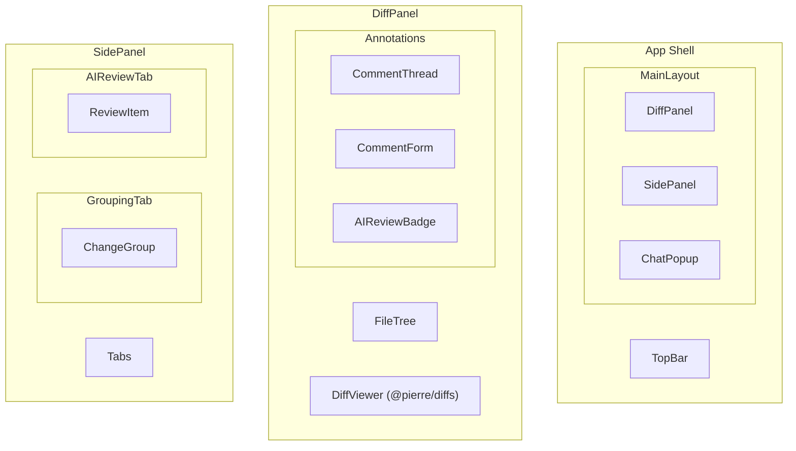

# UI Component Plan for `packages/client`

Based on the PRD and implementation plan, here's a comprehensive component breakdown following the [components.build](https://components.build) specification.

---

## Component Architecture



---

## Shared Types

```typescript
// types/pr.ts
export interface PRInfo {
  number: number;
  title: string;
  author: { login: string; avatarUrl: string };
  description: string;
  baseBranch: string;
  headBranch: string;
  state: 'open' | 'closed' | 'merged';
}

// types/diff.ts
export interface DiffFile {
  path: string;
  oldPath?: string;
  status: 'added' | 'modified' | 'deleted' | 'renamed';
  additions: number;
  deletions: number;
  hunks: DiffHunk[];
}

export interface DiffHunk {
  oldStart: number;
  newStart: number;
  lines: DiffLine[];
}

export interface DiffLine {
  type: 'context' | 'added' | 'deleted';
  content: string;
  oldLineNumber?: number;
  newLineNumber?: number;
}

// types/review.ts
export type Severity = 'critical' | 'warning' | 'info';

export interface ReviewComment {
  id: string;
  filePath: string;
  lineNumber: number;
  content: string;
  author: { type: 'human' | 'ai'; name: string };
  severity?: Severity;
  createdAt: Date;
  replies: ReviewComment[];
  resolved?: boolean;
}

export interface AIReviewItem {
  id: string;
  filePath: string;
  lineNumber: number;
  severity: Severity;
  message: string;
  suggestion?: string;
}

// types/grouping.ts
export interface ChangeGroup {
  id: string;
  title: string;
  summary: string;
  files: string[];
  totalAdditions: number;
  totalDeletions: number;
}
```

---

## Component Breakdown

### 1. TopBar (Compound Component)

**Purpose**: Displays PR metadata and global actions.

```typescript
// TopBar.Root, TopBar.PRInfo, TopBar.Actions
export type TopBarRootProps = React.ComponentProps<'header'>;
export type TopBarPRInfoProps = React.ComponentProps<'div'> & { pr: PRInfo };
export type TopBarActionsProps = React.ComponentProps<'div'>;

export const TopBar = { Root, PRInfo, Actions };
```

| Sub-component | Purpose | Accessibility |
|---------------|---------|---------------|
| `Root` | Header container | `<header role="banner">` |
| `PRInfo` | PR title, author, state badge | Semantic headings |
| `Actions` | Refresh, settings buttons | `aria-label` on icon buttons |

---

### 2. MainLayout (Two-Column)

**Purpose**: Primary layout with resizable left/right panels.

```typescript
export type MainLayoutProps = React.ComponentProps<'main'> & {
  leftPanel: React.ReactNode;
  rightPanel: React.ReactNode;
};
```

**Implementation Notes**:
- Uses CSS Grid or Flexbox with resizable splitter
- Persists panel sizes to localStorage

**Accessibility**:
- `<main role="main">`
- Keyboard-resizable panels via arrow keys
- Skip link to main content

---

### 3. DiffPanel (Compound Component)

**Purpose**: File navigation and diff rendering.

```typescript
export type DiffPanelRootProps = React.ComponentProps<'section'>;

export type DiffPanelFileTreeProps = React.ComponentProps<'nav'> & {
  files: DiffFile[];
  selectedPath?: string;
  onSelectFile: (path: string) => void;
};

export type DiffPanelViewerProps = {
  files: DiffFile[];
  annotations: ReviewComment[];
  onLineClick: (filePath: string, line: number) => void;
};

export const DiffPanel = { Root, FileTree, Viewer };
```

| Sub-component | Purpose | Accessibility |
|---------------|---------|---------------|
| `FileTree` | File list navigation | `<nav aria-label="Changed files">`, `role="tree"` |
| `Viewer` | Renders `@pierre/diffs` MultiFileDiff | Focus management, keyboard line selection |

**UX Notes**:
- FileTree shows file status icons (added/modified/deleted)
- Click file scrolls to that file in diff view
- Line click opens comment form

---

### 4. CommentThread (Compound Component)

**Purpose**: Display and manage comment threads on diff lines.

**Positioning**: **Inline** (like GitHub) — threads expand below the annotated line within the diff view. Uses `@pierre/diffs` annotation system to render comments in-place.

```
│ 42 │   const user = getUser();
│ 43 │ + const token = generateToken();   ← click to add comment
├────┴─────────────────────────────────────────────────────────┤
│ 💬 Alice: Is this token secure enough?                       │
│    └─ 🤖 AI: Consider using crypto.randomUUID() instead...   │
│    └─ Reply input...                                         │
├──────────────────────────────────────────────────────────────┤
│ 44 │   return { user, token };
```

```typescript
export type CommentThreadRootProps = React.ComponentProps<'article'> & {
  threadId: string;
};

export type CommentThreadItemProps = React.ComponentProps<'div'> & {
  comment: ReviewComment;
};

export type CommentThreadFormProps = {
  onSubmit: (content: string) => void;
  onAskAI: (content: string) => void;
  isLoading?: boolean;
};

export const CommentThread = { Root, Item, Form };
```

| Sub-component | Props | Accessibility |
|---------------|-------|---------------|
| `Root` | Container with `aria-label="Comment thread"` | `<article>` |
| `Item` | Displays comment, author, timestamp | `role="comment"`, `<time>` element |
| `Form` | Textarea + action buttons | Label, focus trap, `aria-busy` when loading |

**UX Notes**:
- Reply to AI continues conversation
- "Ask AI" button triggers local CLI for AI response
- Loading state with skeleton/spinner
- Resolve/unresolve thread action

---

### 5. SidePanel (Tabs Component)

**Purpose**: Right panel with tabbed content for grouping and AI review.

```typescript
export type SidePanelRootProps = React.ComponentProps<'aside'>;

// Uses Radix Tabs primitive pattern
export const SidePanel = { Root, TabList, Tab, TabPanel };
```

**Tabs**:
1. **Intelligent Grouping** - Logical change groups
2. **AI Review** - AI findings sorted by severity

**Accessibility**:
- `role="tablist"`, `role="tab"`, `role="tabpanel"`
- Arrow key navigation between tabs
- `aria-selected`, `aria-controls` attributes

---

### 6. IntelligentGrouping

**Purpose**: Display logically grouped changes with summaries.

```typescript
export type IntelligentGroupingProps = {
  groups: ChangeGroup[];
  onGroupClick: (groupId: string) => void;
  isLoading?: boolean;
};

export type ChangeGroupCardProps = React.ComponentProps<'button'> & {
  group: ChangeGroup;
  isActive?: boolean;
};
```

**UX Notes**:
- Click group → scrolls to first file in diff view
- Shows file count, +/- line stats
- Collapsible file list within each group
- Loading skeleton while AI analyzes

---

### 7. AIReviewSummary

**Purpose**: List AI review findings sorted by severity.

```typescript
export type AIReviewSummaryProps = {
  items: AIReviewItem[];
  onItemClick: (item: AIReviewItem) => void;
  isLoading?: boolean;
};

export type ReviewItemCardProps = React.ComponentProps<'button'> & {
  item: AIReviewItem;
};
```

**Severity Variants**:

| Variant | Visual | Icon |
|---------|--------|------|
| `critical` | Red badge | ⛔ Error icon |
| `warning` | Yellow badge | ⚠️ Warning icon |
| `info` | Blue badge | ℹ️ Info icon |

**Click Behavior**:
1. Scrolls diff view to the target file/line
2. AI review is already rendered as an inline comment thread (annotation)
3. Thread is expanded/highlighted so user can see context and reply

**Accessibility**:
- Items sorted by severity (critical first)
- `aria-label` includes severity level
- Click navigates to line in diff view

---

### 8. ChatPopup (Dialog)

**Purpose**: Global chat for Q&A about the PR.

```typescript
export type ChatPopupProps = {
  open?: boolean;
  defaultOpen?: boolean;
  onOpenChange?: (open: boolean) => void;
};

export type ChatMessageProps = React.ComponentProps<'div'> & {
  role: 'user' | 'assistant';
  content: string;
};

export const ChatPopup = { Root, Trigger, Content, Messages, Input };
```

**Composition**:
- `ChatPopup.Root` - Provider with open state
- `ChatPopup.Trigger` - Floating action button
- `ChatPopup.Content` - Dialog container
- `ChatPopup.Messages` - Message list with auto-scroll
- `ChatPopup.Input` - Text input with send button

**Accessibility**:
- `role="dialog"`, `aria-modal="true"`
- Focus trap when open
- `Escape` to close
- `aria-live="polite"` for new messages
- Screen reader announces new messages

---

### 9. SeverityBadge (Utility Component)

**Purpose**: Consistent severity indicator across the app.

```typescript
export type SeverityBadgeProps = React.ComponentProps<'span'> & {
  severity: Severity;
};
```

**CVA Variants**:

```typescript
import { cva, type VariantProps } from 'class-variance-authority';

const badgeVariants = cva(
  'inline-flex items-center gap-1 rounded-full px-2 py-0.5 text-xs font-medium',
  {
    variants: {
      severity: {
        critical: 'bg-destructive text-destructive-foreground',
        warning: 'bg-warning text-warning-foreground',
        info: 'bg-muted text-muted-foreground',
      },
    },
  }
);

export type SeverityBadgeProps = React.ComponentProps<'span'> &
  VariantProps<typeof badgeVariants>;
```

---

## State Management

| State | Pattern | Implementation |
|-------|---------|----------------|
| Selected file | Controlled | `useState` in DiffPanel |
| Comments | Server state | React Query / SWR with optimistic updates |
| AI review items | Server state | React Query, refetch on demand |
| Chat messages | Local + streaming | `useReducer` for message history |
| Panel sizes | Uncontrolled | Persist to localStorage |
| Tab selection | Controllable | `useControllableState` from Radix |

---

## Hooks

```typescript
// hooks/use-pr.ts
export function usePR(prNumber: number): {
  data: PRInfo | undefined;
  isLoading: boolean;
  error: Error | null;
};

// hooks/use-diff.ts
export function useDiff(prNumber: number): {
  files: DiffFile[];
  isLoading: boolean;
  error: Error | null;
};

// hooks/use-comments.ts
export function useComments(prNumber: number): {
  comments: ReviewComment[];
  addComment: (comment: Omit<ReviewComment, 'id' | 'createdAt'>) => Promise<void>;
  isLoading: boolean;
};

// hooks/use-ai-review.ts
export function useAIReview(prNumber: number): {
  items: AIReviewItem[];
  triggerReview: () => Promise<void>;
  isLoading: boolean;
};

// hooks/use-chat.ts
export function useChat(): {
  messages: ChatMessage[];
  sendMessage: (content: string) => Promise<void>;
  isStreaming: boolean;
};
```

---

## Accessibility Checklist

- [ ] All interactive elements keyboard accessible
- [ ] Proper focus management in dialogs/popovers
- [ ] `aria-label` on icon-only buttons
- [ ] Skip links for main content areas
- [ ] `aria-live` regions for async updates (AI responses, comments)
- [ ] Visible focus rings using `focus-visible`
- [ ] Color contrast ratio of 4.5:1 for text
- [ ] 44px minimum touch targets on mobile
- [ ] Semantic HTML elements (`<header>`, `<main>`, `<nav>`, `<article>`)
- [ ] Proper heading hierarchy (h1 → h2 → h3)

---

## File Structure

```
packages/client/src/
├── components/
│   ├── ui/                          # Shadcn UI primitives
│   │   ├── button.tsx
│   │   ├── tabs.tsx
│   │   ├── dialog.tsx
│   │   ├── textarea.tsx
│   │   └── ...
│   ├── top-bar/
│   │   ├── index.tsx                # TopBar compound component
│   │   ├── pr-info.tsx
│   │   └── actions.tsx
│   ├── diff-panel/
│   │   ├── index.tsx                # DiffPanel compound component
│   │   ├── file-tree.tsx
│   │   └── diff-viewer.tsx
│   ├── comment-thread/
│   │   ├── index.tsx                # CommentThread compound component
│   │   ├── comment-item.tsx
│   │   └── comment-form.tsx
│   ├── side-panel/
│   │   ├── index.tsx                # SidePanel with tabs
│   │   ├── intelligent-grouping.tsx
│   │   ├── change-group-card.tsx
│   │   ├── ai-review-summary.tsx
│   │   └── review-item-card.tsx
│   ├── chat-popup/
│   │   ├── index.tsx                # ChatPopup compound component
│   │   ├── message.tsx
│   │   └── input.tsx
│   ├── main-layout.tsx
│   └── severity-badge.tsx
├── hooks/
│   ├── use-pr.ts
│   ├── use-diff.ts
│   ├── use-comments.ts
│   ├── use-ai-review.ts
│   └── use-chat.ts
├── types/
│   ├── pr.ts
│   ├── diff.ts
│   ├── review.ts
│   └── grouping.ts
├── lib/
│   └── utils.ts                     # cn() utility
├── App.tsx
└── main.tsx
```

---

## Design Tokens

Extend Shadcn's default tokens with review-specific colors:

```css
/* globals.css */
:root {
  /* Existing Shadcn tokens... */
  
  /* Review-specific tokens */
  --severity-critical: 0 84% 60%;
  --severity-critical-foreground: 0 0% 100%;
  --severity-warning: 38 92% 50%;
  --severity-warning-foreground: 0 0% 0%;
  --severity-info: 217 91% 60%;
  --severity-info-foreground: 0 0% 100%;
  
  /* Diff colors */
  --diff-added: 142 76% 36%;
  --diff-added-bg: 142 76% 95%;
  --diff-deleted: 0 84% 60%;
  --diff-deleted-bg: 0 84% 95%;
}

.dark {
  --diff-added-bg: 142 76% 15%;
  --diff-deleted-bg: 0 84% 15%;
}
```

---

## Implementation Priority

1. **Phase 1 - Core Layout**
   - MainLayout
   - TopBar
   - DiffPanel (with @pierre/diffs integration)

2. **Phase 2 - Review Features**
   - CommentThread
   - SidePanel with tabs
   - AIReviewSummary

3. **Phase 3 - AI Integration**
   - IntelligentGrouping
   - ChatPopup
   - AI-powered comment replies

4. **Phase 4 - Polish**
   - Keyboard shortcuts
   - Persistence (panel sizes, preferences)
   - Loading states and error boundaries
